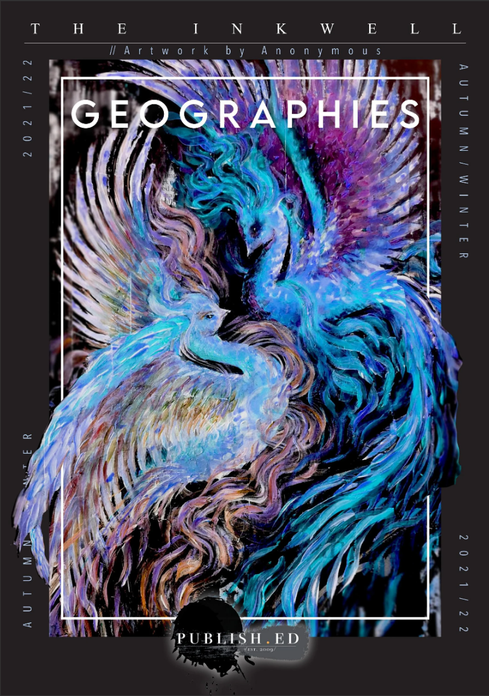
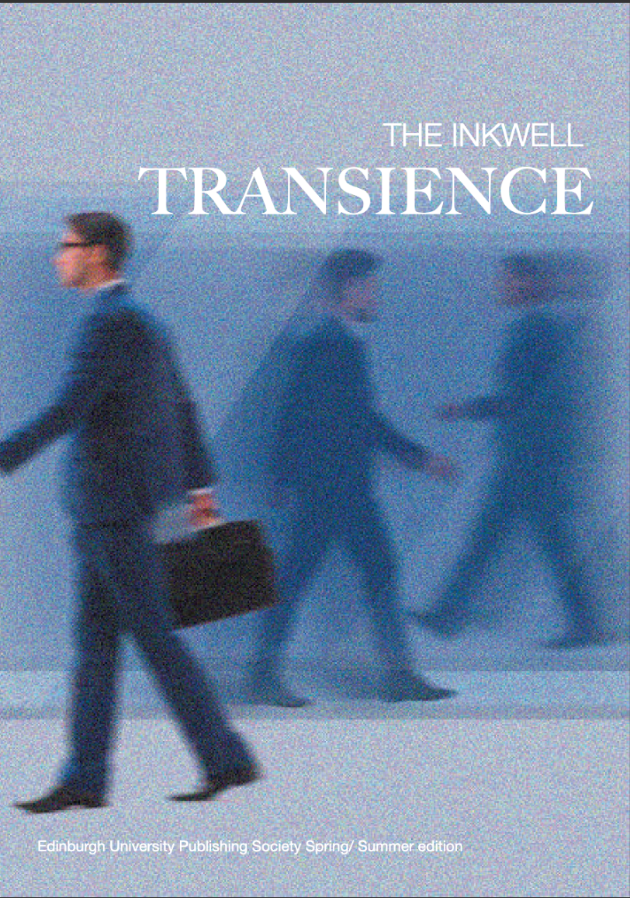

<html>
<head>
  <title>My Now Amazing Webpage</title>
  <link rel="stylesheet" type="text/css" href="slick/slick.css"/>
  <link rel="stylesheet" type="text/css" href="slick/slick-theme.css"/>
  </head>
  <body>
    
  

    
    
  

  
  
  
  

  

  </body>
  
</html>
---
title: Publish.Ed
---
PublishED is the University of Edinburgh’s publishing society, which seeks to provide a community for aspiring publishers, editors, creatives and alike. Our events range from open mic nights and creative writing workshops to nights with local publishers. Through our society, we hope to create a fun yet professional space for students to learn and experience how the book world works. 

Every semester, we produce The Inkwell, our literary magazine. The Inkwell gives young writers the opportunity to publish their creative writing and artwork in a university-sponsored publication.  

This year, we will be running more student-led writing workshops, with the aim of facilitating connections between young writers. We will also be running more events collaborating with other societies.

Guest speakers include Michael Pederson, Edinburgh University Press, Vicki Rutherford from Canongate Publishing House, and more!

Get involved now! 
